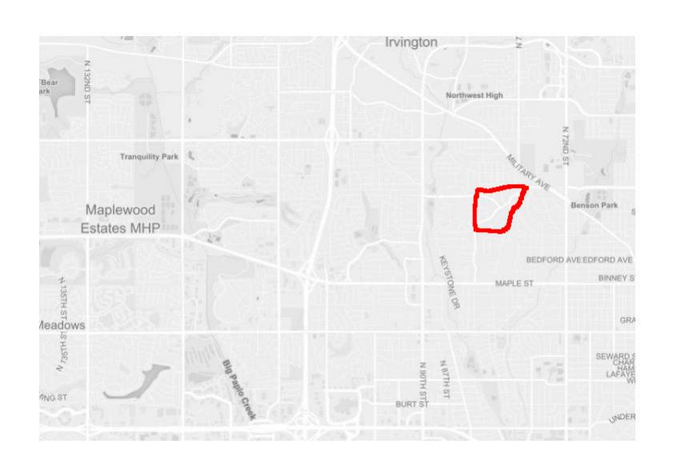

<!-- README.md is generated from README.Rmd. Please edit that file -->

# mapscanner

<!-- badges: start -->

[](https://travis-ci.org/mpadge/mapscanner)
[](https://ci.appveyor.com/project/mpadge/mapscanner)
[](https://codecov.io/gh/mpadge/mapscanner)
[](https://www.repostatus.org/#concept)
<!-- badges: end -->

Print maps, draw on them, scan them back in, and convert to spatial
objects. Package comes with a sample map of Omaha, Nebraska, USA, and
one with some red lines drawn on it: 

That’s just a standard `jpeg` image with no notion of geographical
coordinates. The original map was generated with

``` r
bbox <- rbind (c (-96.12923, -96.01011),
               c (41.26145, 41.32220)) # portion of omaha
ms_generate_map (bbox, max_tiles = 16L, mapname = "omaha")
```

    #> Successfully generated 'omaha.pdf' and 'omaha.jpg'

As indicated, the function generates a map in both `.pdf` and `.jpg`
formats. These files must be retained as the “master” maps against which
subsequently modified – drawn-over and scanned-in – versions will be
rectified. The `.pdf` format is generated because it will generally be
the most convenient for printing, while the rectification itself
requires `.jpg`-format images. The magic happens via the [`RNiftyReg`
package](https://github.com/jonclayden/RNiftyReg), itself primarily
intended to align brain scans and other medical images, but which is
precisely the tool needed here.

The `mapscanner` package comes with two sample `.jpg` images which can
be used to demonstrate functionality. In the following code,
`f_modified` is the image shown above, modified from the original by
drawing a red line around a particular region of Omaha.

``` r
f_original <- file.path ("inst", "extdata", "omaha.jpg")
f_modified <- file.path ("inst", "extdata", "omaha_drawn.jpg")
system.time (res <- ms_rectify_maps (f_original, f_modified, type = "polygons"))
#>    user  system elapsed 
#>  40.630   0.606  11.738
res
#> Simple feature collection with 2 features and 0 fields
#> geometry type:  POLYGON
#> dimension:      XY
#> bbox:           xmin: -96.11759 ymin: 41.26657 xmax: -96.02757 ymax: 41.3008
#> epsg (SRID):    4326
#> proj4string:    +proj=longlat +datum=WGS84 +no_defs
#>                         geometry
#> 1 POLYGON ((-96.04199 41.2963...
#> 2 POLYGON ((-96.11759 41.2697...
```

The rectification can take quite some time, during which [`RNiftyReg`
package](https://github.com/jonclayden/RNiftyReg) is constructing the
best transformation of the modified image back on to the original. The
result of `ms_rectify_maps()` is a spatial object in
[`sf`](https://cran.r-project.org/package=sf)-format in which each drawn
component is represented as a separate polygon. Finally, we can plot the
result as an interactive map using packages like
[`mapdeck`](https://github.com/symbolixAU/mapdeck), or
[`mapview`](https://github.com/r-spatial/mapview):


And our hand-drawn lines shown above have been converted to standard
spatial objects able to be analysed in any desired way.
