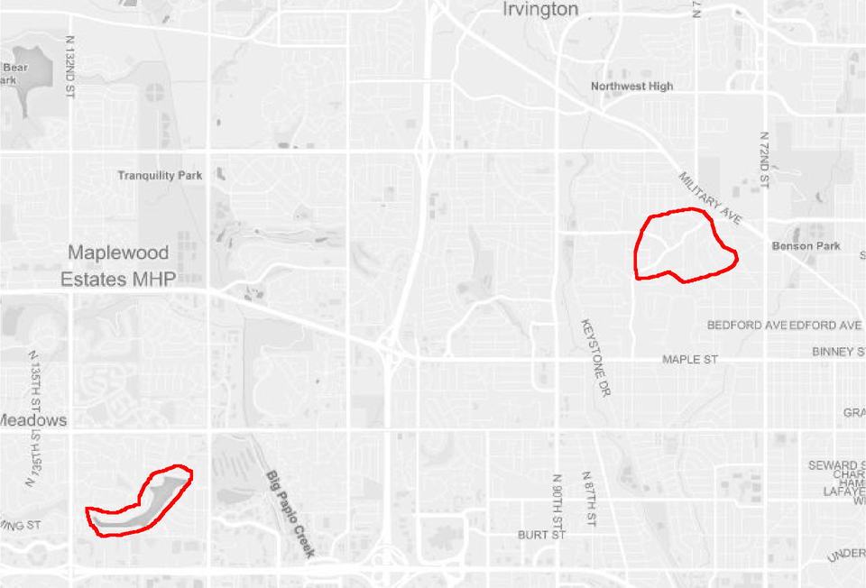
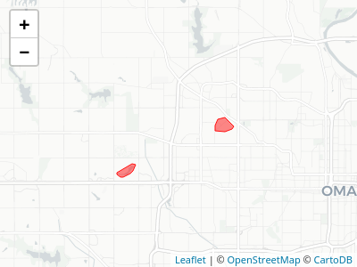

<!-- README.md is generated from README.Rmd. Please edit that file -->

# mapscanner

<!-- badges: start -->

[](https://github.com/ropensci/mapscanner/actions?query=workflow%3AR-CMD-check)
[](https://travis-ci.org/ropensci/mapscanner)
[](https://codecov.io/gh/ropensci/mapscanner)
[](https://www.repostatus.org/#concept)

[](https://github.com/ropensci/onboarding/issues/330)

<!-- badges: end -->

## What does this package do for me?

`mapscanner` is an **R** package that enables lines drawn by hand on
maps to be converted to spatial objects. The package has two primary
functions: one for producing maps, and one for rectifying hand-drawn
lines to the coordinate system of the original map. The package is
intended for use in social surveys and similar endeavours in which
hand-drawn markings on maps need to be converted to spatial objects.
Maps can be either paper- or screen-based. Markings on paper maps need
to be scanned, photographed, or otherwise digitised, while maps with
screen-based markings need to be saved as `.png`-format images.

## installation

`mapscanner` is not (yet) on CRAN. The development version can be
installed with any of the following options:

``` r
remotes::install_github("ropensci/mapscanner")
remotes::install_git("https://git.sr.ht/~mpadge/mapscanner")
remotes::install_bitbucket("mpadge/mapscanner")
remotes::install_gitlab("mpadge/mapscanner")
```

The package can then be loaded for usage in a R session with

``` r
library (mapscanner)
```

## usage

The package is designed to enable the following workflow:

1.  Generate a map with the
    [`ms_generate_map()`](https://docs.ropensci.org/mapscanner/reference/ms_generate_map.html)
    function, which automatically produces both `.pdf` and `.png`
    versions;

2.  Either print the `.pdf` version to use as desired in any kind of
    survey environment, or use either the `.pdf` or `.png` versions in
    digital form for screen-based surveys.

3.  Draw on the map;

4.  For paper maps, digitise the drawn-on (from here on, “modified”)
    map, converting it to either `.pdf` or `.png` format; and

5.  Rectify the modified version against the original via the
    [`ms_rectify_maps()`](https://docs.ropensci.org/mapscanner/reference/ms_rectify_maps.html)
    function, which distinguishes individual annotations, and converts
    each one to a spatial object able to be analysed in any desired
    manner.

### Practical tips

The `mapscanner` package is intended to aid a *practical* workflow, and
so a few practical tips may be recommended here to ensure best results:

1.  The original digital files generated with
    [`ms_generate_map()`](https://docs.ropensci.org/mapscanner/reference/ms_generate_map.html)
    are necessary to rectify subsequently drawn-on and scanned maps, and
    so must be retained at all times.
2.  Marks drawn on maps should be *coloured* – any black or grey
    markings will be ignored. This has the advantage that individual
    annotations *not* intended to be converted to spatial objects (such
    as unique identification or participant codes) may be made on maps
    in black or grey.
3.  For drawings of areas, best results will be achieved through
    ensuring that all lines form closed polygons. While the default
    `type = "hulls"` argument should work even when lines are not
    closed, the `type = "polygons"` argument will generally produce more
    accurate results, yet should only be used when all lines form closed
    polygons (see below for details on how these two differ).
4.  Digitised versions of paper maps should contain *white* borders, so
    do not, for example, photograph modified maps lying on dark
    surfaces. If maps are to be photographed, then best results can be
    achieved by simply placing them on a larger, enclosing sheet of
    white paper.

The following two sections describe the two primary functions of the
`mapscanner` package, corresponding to the two primary steps of
producing maps to be used in surveys (or other activities), and
rectifying modified maps against these originals in order to extract
spatial objects. The second of these sections also describes the kinds
of markings able to be recognised, and the kinds of spatial objects to
which these may be converted.

### Mapbox API tokens

Map generation with `mapscanner` requires a personal token or key from
[`mapbox`](https://mapbox.com), which can be obtained by following the
links from
[https://docs.mapbox.com/api](https://docs.mapbox.com/api/#access-tokens-and-token-scopes).
If you already have a token, the easiest way to use it with `mapscanner`
is to create (or edit) a file `~/.Renviron`, and insert a line,

``` bash
MAPBOX_TOKEN=<my_mapbox_token>
```

This will then be available every time you start R, without any need to
explicitly set the token each time you want to use the package. The
token may be given any unique name that includes “mapbox” (case
insensitive). Alternatively, if you wish to keep your token truly
private, and only use it for your current R session, you may load
`mapscanner`, and then run `set_mapbox_token(<my_mapbox_token>)`.

### Map generation

Having obtained and set a [`mapbox`](https://mapbox.com) token as
described above, `mapscanner` may then be used to generate maps. The
package comes with a sample map of Omaha, Nebraska, USA, and one with
some red lines drawn on it: 

That’s just a standard `png` image with no notion of geographical
coordinates. The original map was generated with

``` r
bbox <- rbind (c (-96.12923, -96.01011),
               c (41.26145, 41.32220)) # portion of omaha
ms_generate_map (bbox, max_tiles = 16L, mapname = "omaha")
```

    #> Successfully generated 'omaha.pdf' and 'omaha.png'

As indicated, the function generates a map in both `.pdf` and `.png`
formats. These files must be retained as the “master” maps against which
subsequently modified – drawn-over and scanned-in – versions will be
rectified.

### Map rectification

The magic within the `mapscanner` package happens via the [`RNiftyReg`
package](https://github.com/jonclayden/RNiftyReg), itself primarily
intended to align brain scans and other medical images, but which is
precisely the tool needed here. The package comes with two sample `.png`
images which can be used to demonstrate map rectification. In the
following code, `f_modified` is the image shown above, modified from the
original by drawing a red line around a particular region of Omaha.

``` r
f_orig <- system.file ("extdata", "omaha.png", package = "mapscanner")
f_mod <- system.file ("extdata", "omaha-polygons.png", package = "mapscanner")
res <- ms_rectify_maps (f_orig, f_mod, type = "polygons")
#> ══ mapscanner ══════════════════════════════════════════════════════════════════
#> ✔ Image [/usr/lib/R/library/mapscanner/extdata/omaha.png] reduced in size by factor of 2
#> ❯ Rectifying the two maps ✔ Rectified the two maps  
#> ❯ Estimating optimal signal-to-noise threshold✔ Estimated optimal signal-to-noise threshold
#> ✔ Identified 2 objects
#> ❯ Converting to spatial format ✔ Converted to spatial format
res
#> Simple feature collection with 2 features and 0 fields
#> geometry type:  POLYGON
#> dimension:      XY
#> bbox:           xmin: -96.11814 ymin: 41.26638 xmax: -96.02722 ymax: 41.30109
#> geographic CRS: WGS 84
#>                         geometry
#> 1 POLYGON ((-96.11589 41.2663...
#> 2 POLYGON ((-96.03544 41.2927...
```

The rectification can take quite some time, during which [`RNiftyReg`
package](https://github.com/jonclayden/RNiftyReg) is constructing the
best transformation of the modified image back on to the original. The
result of `ms_rectify_maps()` is a spatial object in
[`sf`](https://cran.r-project.org/package=sf)-format in which each drawn
component is represented as a separate polygon. Finally, we can plot the
result as an interactive map using packages like
[`mapview`](https://github.com/r-spatial/mapview) with the following
commands:

``` r
library (mapview)
mapview (res)
```

or [`mapdeck`](https://github.com/symbolixAU/mapdeck), which similarly
requires a mapbox token:

``` r
library (mapdeck)
set_token (Sys.getenv ("<my_mapbox_token>"))
mapdeck () %>%
    add_polygon (res, fill_colour = "#ffff00cc",
                 stroke_colour = "#ff0000", stroke_width = 20)
```



And our hand-drawn lines shown above have been converted to standard
spatial objects able to be analysed in any desired way. See the [package
vignette](https://docs.ropensci.org/mapscanner/articles/mapscanner.html)
for more detail of what the `mapscanner` package can do.

## Code of Conduct

Please note that this project is released with a [Contributor Code of
Conduct](CODE_OF_CONDUCT.md). By participating in this project you agree
to abide by its terms.

[](https://ropensci.org)
