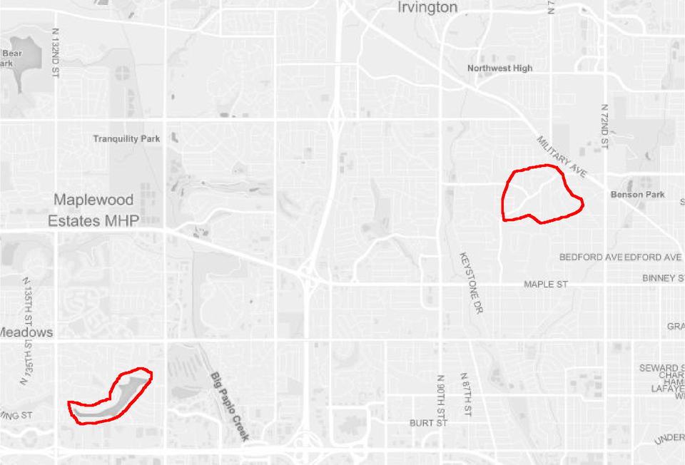

# Summary

`mapscanner` is an **R** package that enables maps to be printed out, drawn on,
scanned back in, and have the drawn components converted to spatial objects. It
is intended for use in social surveys and similar endeavours in which printed
paper maps are preferred over digital screens, and enables marks drawn by hand
on paper maps to be converted to spatial objects. The use of paper maps is
often advantageous because (i) they cost much less than computer devices
otherwise needed for digital equivalents; and (ii) they may in many situations
be deemed to yield more reliable or accurate results through removing the
psychological barriers often associated with screen-based surveys [@Toninelli2016].

# Usage

The package is designed to enable the following workflow:

1. Generate a map with the `ms_generate_map()` function, which automatically
    produces both `.pdf` and `.png` versions;
2. Either print the `.pdf` version to use as desired in any kind of survey
   environment, or use either the `.pdf` or `.png` versions in digital form for
   screen-based surveys.
3. Draw on the map;
4. For paper maps, digitise the drawn-on (from here on, "modified") map,
   converting it to either `.pdf` or `.png` format; and
5. Rectify the modified version against the original via the
   `ms_rectify_maps()` function, which distinguishes individual annotations,
   and converts each one to a spatial object able to be analysed in any
   desired manner.

The following two sections describe the two primary functions of the
`mapscanner` package, corresponding to the two primary steps of producing maps
to be used in surveys (or other activities), and rectifying modified maps
against these originals in order to extract spatial objects. The second of
these sections also describes the kinds of markings able to be recognised, and
the kinds of spatial objects to which these may be converted.


## Map generation

Having obtained and set a [`mapbox`](https://mapbox.com) token as described
in the package website, the `ms_generate_map()` function can be used to
generate printable maps for a specified bounding box in both `.pdf` and `.png`
formats. Usage is a simple as,
``` r
ms_generate_map ("chennai india", mapname = "chennai")
```

The two generated maps are saved in the current working directory (`getwd()`).
To save maps in alternative locations, the `mapname` parameter can optionally
specify paths. To provide finer control over the scales of maps, precise
bounding boxes can also be submitted. To determine desired bounding boxes, we
recommend using the ['openstreetmap.org' website](https://openstreetmap.org),
zooming to a desired area, then clicking the "Export" button. A window will
appear which includes the bounding coordinates of the current screen. Even
finer control can be gained by clicking beneath this coordinate window on the
line which says, "Manually select a different area," which brings a drag-able
rectangle onto the current screen. The coordinates in the bounding box then
simply need to be entered in to the `bbox` parameter of `ms_generate_map()` in
the order (`xmin`, `ymin`, `xmax`, `ymax`) -- or anti-clockwise from the
left-hand coordinate.

The amount of detail in resultant maps is controlled by the `max_tiles`
argument, with larger values producing more detail, and resulting in larger
file sizes. The default value of `max_tiles = 16L` (where the `L` symbol tells
`R`to treat the value as an integer) should produce acceptable results for maps
extending across hundreds of metres to a few kilometres Smaller-scale maps may
require higher values, and vice-versa. Map generation is relatively fast, and
so different values can be readily trialled.

Maps are generated in two formats, because the `.pdf` version will generally
be the most convenient for printing, while the `png` version should be retained
as the "master" copy against which to rectify subsequently scanned-in version.
Behind the scenes, the function downloads a series of vector map tiles from
[mapbox](https://mapbox.com), and converts them to a `rasterBrick` object from
the [`raster` package](https://cran.r-project.org/package=raster). This
`rasterBrick` object is invisibly returned from the function:
``` r
x <- ms_generate_map ("chennai india", mapname = "chennai")
#> Successfully generated 'chennai.pdf' and 'chennai.png'"
x
#> class      : RasterBrick
#> dimensions : 574, 282, 161868, 3  (nrow, ncol, ncell, nlayers)
#> resolution : 76.43703, 76.43703  (x, y)
#> extent     : 8921118, 8942674, 1442749, 1486624  (xmin, xmax, ymin, ymax)
#> crs        : +proj=merc +a=6378137 +b=6378137
#> source     : memory
#> names      : layer.1, layer.2, layer.3
#> min values :     101,     101,     101
#> max values :     255,     255,     255
```
This `rasterBrick` object contains raster information for the three colour
channels of the image, and so may also be used for immediate viewing within
**R** with `raster::plotRGB(x)`.

Standard uses of the package should not need to explicitly access or modify
these data, but it is nevertheless possible to do so, and then use a
custom-modified object to produce the external `.pdf` and `.png` files by
submitting the `rasterBrick` object to `ms_generate_map()`:
``` r
ms_generate_map (raster_brick = x, mapname = "chennai")
```


## Map rectification

Having produced digital maps using the `ms_generate_map()` function as
described above, and having printed, variously drawn-on, and, for paper maps,
scanned the result back in to digital form, the package can then be used to
rectify the hand-drawn markings against the original map with the
`ms_rectify_maps()` function, which returns the drawn-on objects as spatial
objects in [Simple Features (`sf`)](https://cran.r-project.org/package=sf)
format. The only requirement is that the drawn-on objects are coloured; black
or grey objects will be ignored. As described above, this has the advantage
that maps may be annotated in ways not intended to be converted to spatial
objects (such as adding unique identification or participant codes), through
simply providing such annotations in grey or black.

The `ms_rectify_maps()` function has two primary arguments, specifying the
names (and locations) of the original and modified map files -- in that order:
`ms_rectify_maps(original, modified)`. These files should ideally be in `.png`
formats, but will be auto-converted from `.pdf` if needed. The package comes
with two sample maps, both in `.png` format. The first is the reference version
needed for rectification, while the second has two red lines drawn upon it:



Converting the lines on this scanned image file is then as simple as:

``` r
f_orig <- system.file ("extdata", "omaha.png", package = "mapscanner")
f_mod <- system.file ("extdata", "omaha-polygons.png", package = "mapscanner")
xy <- ms_rectify_maps (f_orig, f_mod, nitems = 2)
```
The result of `ms_rectify_maps()` can be plotted using any standard option for
plotting spatial data, such as through online mapping packages such as
`mapview`:
``` r
xy$id <- seq (nrow (xy))
mapview::mapview (xy)
```


### Types of map markings and types of spatial objects

The `ms_rectify_maps()` function has an additional argument, `type`, which
takes the following values:

1. `type = "hulls"` (the default), which returns convex or concave hulls around
   distinct sets of contiguously marked lines, regardless of whether those
   lines form closed polygons or not (see function help for details).
2. `type = "polygons"`, which returns the outlines traced around each
   individual drawn object. This tracing is pixel-based, resulting in polygons
   with one spatial point for each scanned pixel. This may generate spatial
   objects that are both overly large as well as visually pixillated. The
   function includes an additional `downsample` parameter which down-samples
   and smooths the resultant polygons by the specified multiple.
3. `type = "points"`, which returns single points (as geometric centroids) for
   each object. This is useful for identification of individual point locations
   regardless of the kinds of marks actually drawn on a map (dots, circles,
   crosses, or any shape, should all give equivalent results).

The type of `polygons` assumes -- and indeed requires -- that the drawn objects
are *closed* polygons (as illustrated in the first of the above figures), so
care must be taken to ensure this is in fact the case. Any lines that do not
form closed circles will not be appropriately translated. Algorithms for
extracting objects with `type = "polygons"`are fundamentally different from
`type = "hulls"`. The latter applies convex or concave-hull tracing algorithms,
while the former explicitly traces every individual pixel of a contiguous
object, and returns the external boundary comprised of the coordinates of all
pixels lying on that boundary. This will thus often produce more accurate and
detailed results, yet as mentioned should only be applied where markings form
strictly closed polygons. All other cases in which areal rather than
point-based results are desired should use the default `type = "hulls"`.
Examples include participants being asked to colour particular areas using any
desired kind of marks, enabling areal-filling scribbles can be converted to
polygons representing the outer boundaries.


## Bonus Feature: Polygon Aggregation

Maps are typically used in social surveys to delineate participants'
understanding or perception of particular regions or areas. In such contexts,
surveys often result in numerous polygonal shapes representing different
perceptions of a particular region. The `mapscanner` package provides an
additional function, `ms_aggregate_polys()`, to aggregate polygons into
a single "heat map" containing vector outlines of aggregated polygons. Each
component of these aggregated polygons defines the region within which `n`
polygons overlap.

The function is now illustrated with a slightly more complicated version of the
example provided for `ms_aggregate_polys()`, starting by generating a series of
polygons as convex hulls surrounding random points.
``` r
n <- 5 # number of polygons
polys <- lapply (seq (n), function (i) {
                     nxy <- 20 # number of points used to generate hull
                     xy <- matrix (runif (2 * nxy), ncol = 2)
                     h <- chull (xy)
                     sf::st_polygon (list (xy [c (h, h [1]), ]))
            })
polys <- sf::st_sf (n = seq (n), geometry = polys)
```
The `polys` object is then a Simple Features
([`sf`](https://cran.r-project.org/package=sf))
`data.frame` with `n` overlapping polygons, and an additional row, `n`, to
identify each polygon. The following lines then convert these to aggregated,
overlapping polygons, and plot the result:
``` r
aggr <- ms_aggregate_polys (polys)
polys$type <- "raw polygons"
aggr$type <- "aggregated polygons"
polys <- rbind (polys, aggr)
library (ggplot2)
ggplot (polys, aes (fill = n)) + geom_sf () + facet_wrap (~type)
```
See the package website for the resultant plot. The object returned from
`ms_aggregate_polys()` contains polygons ordered by level of aggregation (`n`),
so the first entirely encloses the second; the second encloses the third; and
so on. Particular contours can then be directly selected by filtering for
desired values of `n`:
``` r
ggplot (aggr [aggr$n %in% c (1, 3, 5), ], aes (fill = n)) + geom_sf ()
```

Polygon aggregation enables many interesting analyses to be performed, such as
relationships between aggregation level and area:
``` r
aggr$area <- sf::st_area (aggr)
ggplot (aggr, aes (x = n, y = area)) + geom_line (size = 2)
```

The result (again, shown on main package website) is of course (roughly)
linear, because it was derived from random data. In actual usage, results such
as that are likely to generate direct insight into consensus of opinion
regarding how people understand particular areas.


# References
