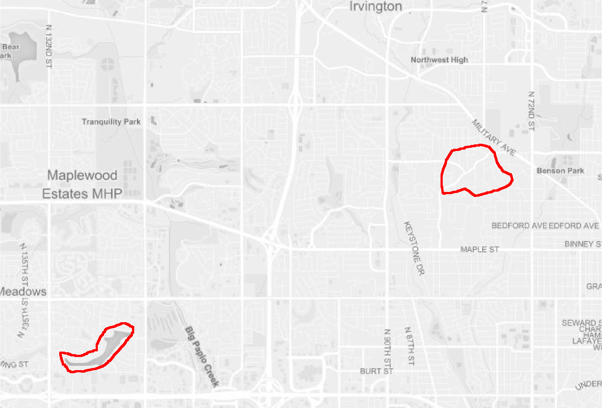

```{r pkg-load, echo = FALSE, message = FALSE}
library (mapscanner)
requireNamespace ("sf")
```

## What does this package do for me?


`mapscanner` is an **R** package that enables maps to be printed out, drawn on,
scanned back in, and have the drawn components converted to spatial objects. 

## How do I use it?

Briefly, the package is designed to enable the following workflow:

1. Generate a map with the `ms_generate_map()` function, which automatically
   produces both `.pdf` and `.png` versions;
2. Print the `.pdf` version to use as desired in any kind of survey environment
   where drawing on paper is more convenient -- or more importantly, where it
   may be judged to yield more accurate results;
3. Draw on the map;
4. Digitise the drawn-on (from here on, "modified") map, converting it to
   either `.pdf` or `.png` format. (Common methods here are scanning, or even
   just photographing with a mobile device); and
5. Rectify the modified version with the original via the `ms_rectify_maps()`
   function, which distinguishes the individual annotations, and converts each
   one to a spatial object able to be analysed in any desired manner.

The two primary functions are described in more detail below.


## How do I install it?

`mapscanner` is not yet on CRAN, so must be installed with the `remotes`
package:
```{r install, eval = FALSE}
remotes::install_github ("mpadge/mapscanner")
```

## Map generation

The `ms_generate_map()` function generates printable maps for a specified
bounding box in both `.pdf` and `.png` formats. Usage is a simple as,
```{r generate-fakey, eval = FALSE}
ms_generate_map ("chennai india", mapname = "chennai")
```
The two generated maps are saved in the current working directory (`getwd()`).
To save in alternative locations, the `mapname` parameter can The `mapname` can
optionally specify paths, 
```{r generate-fakey2, eval = FALSE}
ms_generate_map ("chennai india", mapname = file.path ("my", "directory", "chennai"))
```
The map is generated in two formats, because the `.pdf` version will generally
be the most convenient for printing, while the `png` version should be retained
as the "master" copy against which to rectify subsequently scanned-in version.

Behind the scenes, the function downloads a series of vector map tiles from
[mapbox](https://mapbox.com), and converts them to a `rasterBrick` object from
the [`raster` package](https://cran.r-project.org/package=raster).
This `rasterBrick` object is invisibly returned from the function:
```{r chennaiBrick-fakey, eval = FALSE}
x <- ms_generate_map ("chennai india", mapname = "chennai")
x
```
```{r chennaiBrick, echo = FALSE}
message ("Successfully generated 'chennai.pdf' and 'chennai.png'")
x <- paste0 ("class      : RasterBrick\n",
    "dimensions : 574, 282, 161868, 3  (nrow, ncol, ncell, nlayers)\n",
    "resolution : 76.43703, 76.43703  (x, y)\n",
    "extent     : 8921118, 8942674, 1442749, 1486624  (xmin, xmax, ymin, ymax)\n",
    "crs        : +proj=merc +a=6378137 +b=6378137\n",
    "source     : memory\n",
    "names      : layer.1, layer.2, layer.3\n",
    "min values :     101,     101,     101\n",
    "max values :     255,     255,     255")
message (x)
```

Standard uses of the package should not need to explicitly access or modify
these data, but it is nevertheless possible to do so, and then use a
custom-modified object to produce the external `.pdf` and `.png` files by
submitting the `rasterBrick` object to `ms_generate_map()`:
```{r chennaiBrick2, eval = FALSE}
ms_generate_map (raster_brick = x, mapname = "chennai")
```


## Map rectification

The procedure outlined in the first four of the five steps above should produce
one or more digitised versions of maps with coloured annotations. The 
`ms_rectify_maps()` function rectifies these maps with the original, returning
the drawn-on objects as spatial objects in [Simple Features
(`sf`)](https://cran.r-project.org/package=sf) format. The only requirement is
that the drawn-on objects are coloured; black or grey objects will not be
recognised.

This function has only two primary arguments, specifying the names (and
locations) of the original and modified map files. These files should ideally
be in `.png` formats, but will be auto-converted from `.pdf` if needed. (The
`.png` format is necessary for the actual rectification function, as described
below.) The package comes with two sample maps, both in `.png` format. The
first is the reference version needed for rectification, while the second has
two red lines drawn upon it:



Converting the lines on this scanned image file is then as simple as:

```{r rectify}
f_orig <- system.file ("extdata", "omaha.png", package = "mapscanner")
f_mod <- system.file ("extdata", "omaha-polygons.png", package = "mapscanner")
xy <- ms_rectify_maps (f_orig, f_mod)
xy
```

The `ms_rectify_maps()` function has an additional argument, `type`, with
a default value of `"polygons"`. These polygons are the outlines traced around
each individual drawn object. This tracing is pixel-based, resulting in
polygons with one point for each scanned pixel which can be both overly large
objects as well as visually pixillated. The function includes an additional
`downsample` parameter for `type = "polygon"` which down-samples as smooths the
resultant polygons by the specified multiple.

Two other `type` parameters are:

1. `hulls` to return convex hulls surrounding all pixels in each object; and
2. `points` to return single points (as geometric centroids) for each object.

The default type of `polygons` assumes -- and indeed requires -- that the drawn
objects are *closed* polygons, so care must be taken to ensure this is in fact
the case. Any lines that do not form closed circles will not be appropriately
translated. The `type = "hulls"` argument is provided for cases where closed
lines are inappropriate, while the `type = "points"` argument is provided for
identification of individual point locations regardless of the kinds of marks
actually drawn on a map (dots, circles, crosses, or any shape, should all give
equivalent results).

The result of `ms_rectify_maps()` can, for example, be submitted directly to an
online mapping package such as `mapview`:
```{r mapview, eval = FALSE, echo = FALSE}
xy$id <- seq (nrow (xy))
x <- mapview::mapview (xy)
mapview::mapshot (x, file = "mapshot.png")
```
```{r mapview-fakey, eval = FALSE}
xy$id <- seq (nrow (xy))
mapview::mapview (xy)
```


## How it works

(Feel free to skip this section, which provides detail for those interested in
how the process actually works.) `mapscanner` primarily relies on the
[`RNiftyReg` package](https://github.com/jonclayden/RNiftyReg) to rectify the
images. This package is itself primarily aimed at rectifying medical scans, but
also happens to be the perfect tool for the present purposes. Being an image
recognition software, the library requires image objects, and so not `pdf`
files, which is why the `ms_generate_map()` function produces both kinds of
image - the `.pdf` for printing and the `.png` for rectifying with the
`RNiftyReg` package.

Rectification re-projects a scanned image back on to the coordinate system of
an original image. This coordinate system translates here in to a defined
bounding box (which will generally differ slightly from the values input into
the function, due to the cutting and stitching of the vector tiles). This
bounding box is embedded as meta-information in both the files produced by
`ms_generate_map()`; in the `.pdf` as standard meta information accessible in
**R** like this:

```{r pdfinfo-fakey, eval = FALSE}
pdftools::pdf_info ("chennai.pdf")$keys
```
```{r pdfinfo, echo = FALSE}
x <- list ("Title" = "EX8921118.44521949+1442748.9088827+8942673.68719591+1486623.76311839",
           "Producer" = "R 3.6.0",
           "Creator" = "R")
x
```

or in a terminal via `pdfinfo` (or non-linux equivalent). The equivalent meta
information is embedded in the `.png` file as comment, accessible
like this:

```{r img-comment-fakey, eval = FALSE}
img <- magick::image_read ("chennai.png")
magick::image_comment (img)
```
```{r img-comment, echo = FALSE}
"EX8921118.44521949+1442748.9088827+8942673.68719591+1486623.76311839"
```
or in a terminal via `identify -verbose` command (itself part of `imagemagick`).

## Tips for Practical Usage

Observing the following points will ensure that the `mapscanner` package
produces optimal results:

1. Do not lose the original versions generated with `ms_generate_map()` --
   without at least one of these files, no scanned-in maps can be rectified.
2. Drawings on maps should be in colour - not black or grey.
3. For drawings of areas, care should be taken to ensure all lines form closed
   polygons; only in cases where this is not possible or practicable, the `type
   = "hulls"` argument should be used in map rectification.
4. The digitised version should contain a *white* border, so do not, for
   example, photograph the drawn-on map lying on a dark surface. If maps are to
   be photographed, then best results can be achieved by simply placing them on
   a larger, enclosing sheet of white paper.
