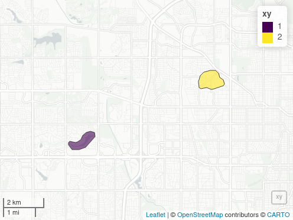
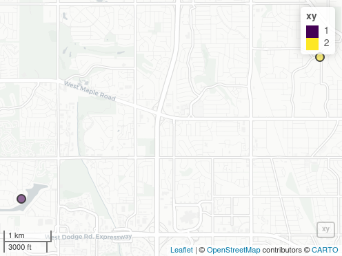

```{r pkg-load, echo = FALSE, message = FALSE}
library (mapscanner)
library (ggplot2)
requireNamespace ("sf")
# vwidth/height are passed via mapview::mapshot to webshot::webshot,
# and default to (992,744), which bloats package size (issue #27).
red <- 2
vwidth <- 992 / red
vheight <- 744 / red
```

<!--
A NOTE regarding the size of this vignette, for which it was difficult to
produce a sufficiently small sized end result, largely because of the mapshot
images. The above values can be passed to mapshot to reduce those. The
following table shows sizes of resultant installed versions following various
options:

ggplot | mapshot } inst size | vignettes size
---  | --- | --- | ---
 -   |  -  | 2.2MB | 1.2MB
 yes |  -  | 2.4MB | 1.5MB
 yes |  1  | 2.9MB | 2.0MB (original mapshot image only)
 yes |  3  | 3.4MB | 2.5MB

 At present, the vignette is rendered as in the final row, but can potentially
 be reduced in size in the future according to this table. -->


## What does this package do for me?

`mapscanner` is an **R** package that enables lines drawn by hand on maps to be
converted to spatial objects. The package has two primary functions: one for
producing maps, and one for rectifying hand-drawn lines to the coordinate
system of the original map. The package is intended for use in social surveys
and similar endeavours in which hand-drawn markings on maps need to be
converted to spatial objects. Maps can be either paper- or screen-based.
Markings on paper maps need to be scanned, photographed, or otherwise
digitised, while maps with screen-based markings need to be saved as
`.png`- or `.pdf`-format images.


## How do I use it?

### Installation

`mapscanner` is not yet on CRAN, so must be installed with the `remotes`
package:
```{r install, eval = FALSE}
remotes::install_github ("mpadge/mapscanner")
```
After that, the library can be loaded with
```{r load}
library (mapscanner)
```

### Usage

The package is designed to enable the following workflow:

1. Generate a map with the
   [`ms_generate_map()`](https://mpadge.github.io/mapscanner/reference/ms_generate_map.html)
   function, which automatically produces both `.pdf` and `.png` versions;

2. Either print the `.pdf` version to use as desired in any kind of survey
   environment, or use either the `.pdf` or `.png` versions in digital form for
   screen-based surveys.

3. Draw on the map;

4. For paper maps, digitise the drawn-on (from here on, "modified") map,
   converting it to either `.pdf` or `.png` format; and

5. Rectify the modified version against the original via the
   [`ms_rectify_maps()`](https://mpadge.github.io/mapscanner/reference/ms_rectify_maps.html)
   function, which distinguishes individual annotations,
   and converts each one to a spatial object able to be analysed in any desired
   manner.

### Practical tips

The `mapscanner` package is intended to aid a *practical* workflow, and so
a few practical tips may be recommended here to ensure best results:

1. The original digital files generated with
   [`ms_generate_map()`](https://mpadge.github.io/mapscanner/reference/ms_generate_map.html)
   are necessary to rectify subsequently drawn-on and scanned maps, and so must
   be retained at all times.
2. Marks drawn on maps should be *coloured* -- any black or grey markings will
   be ignored. This has the advantage that individual annotations *not*
   intended to be converted to spatial objects (such as unique identification
   or participant codes) may be made on maps in black or grey.
3. For drawings of areas, best results will be achieved through ensuring that
   all lines form closed polygons. While the default `type = "hulls"` argument
   should work even when lines are not closed, the `type = "polygons"` argument
   will generally produce more accurate results, yet should only be used when
   all lines form closed polygons (see below for details on how these two differ).
4. Digitised versions of paper maps should contain *white* borders, so do not,
   for example, photograph modified maps lying on dark surfaces. If maps are to
   be photographed, then best results can be achieved by simply placing them on
   a larger, enclosing sheet of white paper.

The following two sections describe the two primary functions of the
`mapscanner` package, corresponding to the two primary steps of producing maps
to be used in surveys (or other activities), and rectifying modified maps
against these originals in order to extract spatial objects. The second of
these sections also describes the kinds of markings able to be recognised, and
the kinds of spatial objects to which these may be converted.

## Mapbox API tokens

Map generation with `mapscanner` requires a personal token or key from
[`mapbox`](https://mapbox.com), which can be obtained by following the links
from
[https://docs.mapbox.com/api](https://docs.mapbox.com/api/#access-tokens-and-token-scopes).
If you already have a token, the easiest way to use it with `mapscanner` is to
create (or edit) a file `~/.Renviron`, and insert a line,

``` bash
MAPBOX_TOKEN=<my_mapbox_token>
```
This will then be available every time you start R, without any need to
explicitly set the token each time you want to use the package. The token may
be given any unique name that includes "mapbox" (case insensitive).
Alternatively, if you wish to keep your token truly private, and only use it
for your current R session, you may load `mapscanner`, and then run
`set_mapbox_token(<my_mapbox_token>)`.


## Map generation

Having obtained and set a [`mapbox`](https://mapbox.com) token as described
above, the
[`ms_generate_map()`](https://mpadge.github.io/mapscanner/reference/ms_generate_map.html)
function can be used to generate printable maps for a specified bounding box in
both `.pdf` and `.png` formats. Usage is a simple as,
```{r generate-fakey, eval = FALSE}
ms_generate_map ("chennai india", mapname = "chennai")
```
```{r generate, echo = FALSE}
message ("Successfully generated 'chennai.pdf' and 'chennai.png'")
```

The two generated maps are saved in the current working directory (`getwd()`).
To save maps in alternative locations, the `mapname` parameter can optionally
specify paths. To provide finer control over the scales of maps, precise
bounding boxes can also be submitted. To determine desired bounding boxes, we
recommend using the ['openstreetmap.org' website](https://openstreetmap.org),
zooming to a desired area, then clicking the "Export" button. A window will
appear which includes the bounding coordinates of the current screen. Even
finer control can be gained by clicking beneath this coordinate window on the
line which says, "Manually select a different area," which brings a drag-able
rectangle onto the current screen. The coordinates in the bounding box then
simply need to be entered in to the `bbox` parameter of
[`ms_generate_map()`](https://mpadge.github.io/mapscanner/reference/ms_generate_map.html)
in the order (`xmin`, `ymin`, `xmax`, `ymax`) -- or anti-clockwise from the
left-hand coordinate.

The amount of detail in resultant maps is controlled by the `max_tiles`
argument, with larger values producing more detail, and resulting in larger
file sizes. The default value of `max_tiles = 16L` (where the `L` symbol tells
`R`to treat the value as an integer) should produce acceptable results for maps
extending across hundreds of metres to a few kilometres Smaller-scale maps may
require higher values, and vice-versa. Map generation is relatively fast, and
so different values can be readily trialled.

Maps are generated in two formats, because the `.pdf` version will generally
be the most convenient for printing, while the `png` version should be retained
as the "master" copy against which to rectify subsequently scanned-in version.
Behind the scenes, the function downloads a series of vector map tiles from
[mapbox](https://mapbox.com), and converts them to a `rasterBrick` object from
the [`raster` package](https://cran.r-project.org/package=raster). This
`rasterBrick` object is invisibly returned from the function:
```{r chennaiBrick-fakey, eval = FALSE}
x <- ms_generate_map ("chennai india", mapname = "chennai")
```
```{r, echo = FALSE}
message ("Successfully generated 'chennai.pdf' and 'chennai.png'")
```
```{r x, eval = FALSE}
x
```
```{r chennaiBrick, echo = FALSE}
x <- paste0 ("class      : RasterBrick\n",
    "dimensions : 574, 282, 161868, 3  (nrow, ncol, ncell, nlayers)\n",
    "resolution : 76.43703, 76.43703  (x, y)\n",
    "extent     : 8921118, 8942674, 1442749, 1486624  (xmin, xmax, ymin, ymax)\n",
    "crs        : +proj=merc +a=6378137 +b=6378137\n",
    "source     : memory\n",
    "names      : layer.1, layer.2, layer.3\n",
    "min values :     101,     101,     101\n",
    "max values :     255,     255,     255")
message (x)
```
This `rasterBrick` object contains raster information for the three colour
channels of the image, and so may also be used for immediate viewing within
**R** with `raster::plotRGB(x)`.

Standard uses of the package should not need to explicitly access or modify
these data, but it is nevertheless possible to do so, and then use a
custom-modified object to produce the external `.pdf` and `.png` files by
submitting the `rasterBrick` object to
[`ms_generate_map()`](https://mpadge.github.io/mapscanner/reference/ms_generate_map.html):
```{r chennaiBrick2, eval = FALSE}
ms_generate_map (raster_brick = x, mapname = "chennai")
```


## Map rectification

Having produced digital maps using the
[`ms_generate_map()`](https://mpadge.github.io/mapscanner/reference/ms_generate_map.html)
function as described above, and having printed, variously drawn-on, and, for
paper maps, scanned the result back in to digital form, the package can then be
used to rectify the hand-drawn markings against the original map with the
[`ms_rectify_maps()`](https://mpadge.github.io/mapscanner/reference/ms_rectify_maps.html)
function, which returns the drawn-on objects as spatial objects in [Simple
Features (`sf`)](https://cran.r-project.org/package=sf) format. The only
requirement is that the drawn-on objects are coloured; black or grey objects
will be ignored. As described above, this has the advantage that maps may be
annotated in ways not intended to be converted to spatial objects (such as
adding unique identification or participant codes), through simply providing
such annotations in grey or black.

The
[`ms_rectify_maps()`](https://mpadge.github.io/mapscanner/reference/ms_rectify_maps.html)
function has two primary arguments, specifying the names (and locations) of the
original and modified map files -- in that order: `ms_rectify_maps(original,
modified)`. These files should ideally be in `.png` formats, but will be
auto-converted from `.pdf` if needed. The package comes with two sample maps,
both in `.png` format. The first is the reference version needed for
rectification, while the second has two red lines drawn upon it:

<!--

-->
```{r omaha-poly-png, echo = FALSE, out.width = "75%", eval = TRUE}
knitr::include_graphics ("omaha-polygons.png")
```


Converting the lines on this scanned image file is then as simple as:

```{r rectify, message = FALSE}
f_orig <- system.file ("extdata", "omaha.png", package = "mapscanner")
f_mod <- system.file ("extdata", "omaha-polygons.png", package = "mapscanner")
xy <- ms_rectify_maps (f_orig, f_mod, nitems = 2)
xy
```
The result of
[`ms_rectify_maps()`](https://mpadge.github.io/mapscanner/reference/ms_rectify_maps.html)
can be plotted using any standard option for plotting spatial data, such as
through online mapping packages such as `mapview`:
```{r mapshot-hulls, eval = TRUE, echo = FALSE}
xy$id <- seq (nrow (xy))
if (!file.exists ("mapshot-polys.png"))
{
    x <- mapview::mapview (xy)
    mapview::mapshot (x, file = "mapshot-hulls.png",
                      remove_controls = c ("layersControl", "zoomControl"),
                      vwidth = vwidth, vheight = vheight)
}
```
```{r mapview-fakey, eval = FALSE}
xy$id <- seq (nrow (xy))
mapview::mapview (xy)
```

<!--

-->
```{r mapshot-hulls-png, echo = FALSE, out.width = "75%"}
knitr::include_graphics ("mapshot-hulls.png")
#plot (xy)
```


### Types of map markings and types of spatial objects

The
[`ms_rectify_maps()`](https://mpadge.github.io/mapscanner/reference/ms_rectify_maps.html)
function has an additional argument, `type`, which takes the following values:

1. `type = "hulls"` (the default), which returns convex or concave hulls around
   distinct sets of contiguously marked lines, regardless of whether those
   lines form closed polygons or not (see function help for details).
2. `type = "polygons"`, which returns the outlines traced around each
   individual drawn object. This tracing is pixel-based, resulting in polygons
   with one spatial point for each scanned pixel. This may generate spatial
   objects that are both overly large as well as visually pixillated. The
   function includes an additional `downsample` parameter which down-samples
   and smooths the resultant polygons by the specified multiple.
3. `type = "points"`, which returns single points (as geometric centroids) for
   each object. This is useful for identification of individual point locations
   regardless of the kinds of marks actually drawn on a map (dots, circles,
   crosses, or any shape, should all give equivalent results).

The type of `polygons` assumes -- and indeed requires -- that the drawn objects
are *closed* polygons (as illustrated in the first of the above figures), so
care must be taken to ensure this is in fact the case. Any lines that do not
form closed circles will not be appropriately translated. Algorithms for
extracting objects with `type = "polygons"`are fundamentally different from
`type = "hulls"`. The latter applies convex or concave-hull tracing algorithms,
while the former explicitly traces every individual pixel of a contiguous
object, and returns the external boundary comprised of the coordinates of all
pixels lying on that boundary. This will thus often produce more accurate and
detailed results, yet as mentioned should only be applied where markings form
strictly closed polygons. All other cases in which areal rather than
point-based results are desired should use the default `type = "hulls"`.
Examples include participants being asked to colour particular areas using any
desired kind of marks, enabling areal-filling scribbles can be converted to
polygons representing the outer boundaries.

The `"polygon"` and `"point"` types are illustrated in the following maps:
```{r type-polys}
f_orig <- system.file ("extdata", "omaha.png", package = "mapscanner")
f_mod <- system.file ("extdata", "omaha-polygons.png", package = "mapscanner")
xy <- ms_rectify_maps (f_orig, f_mod, type = "polygons", quiet = TRUE)
```
```{r mapview-polys, eval = TRUE, echo = FALSE}
xy$id <- seq (nrow (xy))
if (!file.exists ("mapshot-polys.png"))
{
    x <- mapview::mapview (xy)
    mapview::mapshot (x, file = "mapshot-polys.png",
                      remove_controls = c ("layersControl", "zoomControl"),
                      vwidth = vwidth, vheight = vheight)
}
```
```{r mapview-polys-fakey, eval = FALSE}
xy$id <- seq (nrow (xy))
mapview::mapview (xy)
```

<!--

-->
```{r mapshot-polys-png, echo = FALSE, out.width = "75%"}
knitr::include_graphics ("mapshot-polys.png")
#plot (xy)
```


```{r type-points}
f_orig <- system.file ("extdata", "omaha.png", package = "mapscanner")
f_mod <- system.file ("extdata", "omaha-polygons.png", package = "mapscanner")
xy <- ms_rectify_maps (f_orig, f_mod, type = "points", quiet = TRUE)
```
```{r mapview-points, eval = TRUE, echo = FALSE}
xy$id <- seq (nrow (xy))
if (!file.exists ("mapshot-points.png"))
{
    x <- mapview::mapview (xy)
    mapview::mapshot (x, file = "mapshot-points.png",
                      remove_controls = c ("layersControl", "zoomControl"),
                      vwidth = vwidth, vheight = vheight)
}
```
```{r mapview-points-fakey, eval = FALSE}
xy$id <- seq (nrow (xy))
mapview::mapview (xy)
```

<!--

-->
```{r mapshot-points-png, echo = FALSE, out.width = "75%"}
knitr::include_graphics ("mapshot-points.png")
#plot (xy)
```


## Bonus Feature: Polygon Aggregation

Maps are typically used in social surveys to delineate participants'
understanding or perception of particular regions or areas. In such contexts,
surveys often result in numerous polygonal shapes representing different
perceptions of a particular region. The `mapscanner` package provides an
additional function, `ms_aggregate_polys()`, to aggregate polygons into
a single "heat map" containing vector outlines of aggregated polygons. Each
component of these aggregated polygons defines the region within which `n`
polygons overlap.

The function is now illustrated with a slightly more complicated version of the
example provided for `ms_aggregate_polys()`, starting by generating a series of
polygons as convex hulls surrounding random points.
```{r random-polys-fakey, eval = FALSE}
n <- 5 # number of polygons
polys <- lapply (seq (n), function (i) {
                     nxy <- 20 # number of points used to generate hull
                     xy <- matrix (runif (2 * nxy), ncol = 2)
                     h <- chull (xy)
                     sf::st_polygon (list (xy [c (h, h [1]), ]))
            })
polys <- sf::st_sf (n = seq (n), geometry = polys)
```
The `polys` object is then a Simple Features
([`sf`](https://cran.r-project.org/package=sf))
`data.frame` with `n` overlapping polygons, and an additional row, `n`, to
identify each polygon. The following lines then convert these to aggregated,
overlapping polygons, and plot the result:
```{r random-polys-fakey2, eval = FALSE}
aggr <- ms_aggregate_polys (polys)
polys$type <- "raw polygons"
aggr$type <- "aggregated polygons"
polys <- rbind (polys, aggr)
library (ggplot2)
ggplot (polys, aes (fill = n)) + geom_sf () + facet_wrap (~type)
```
```{r random-polys, echo = FALSE, eval = TRUE}
n <- 5 # number of polygons
polys <- lapply (seq (n), function (i) {
                     nxy <- 20 # number of points used to generate hull
                     xy <- matrix (runif (2 * nxy), ncol = 2)
                     h <- chull (xy)
                     sf::st_polygon (list (xy [c (h, h [1]), ]))
            })
polys <- sf::st_sf (n = seq (n), geometry = polys)
aggr <- ms_aggregate_polys (polys)
polys$type <- "raw polygons"
aggr$type <- "aggregated polygons"
polys <- rbind (polys, aggr)
theme_set (theme_minimal ())
labeller <- c (
               `aggregated polygons` = "raw polygons",
               `raw polygons` = "aggregated polygons")
ggplot (polys, aes (fill = n)) + geom_sf () +
    facet_wrap (~rev (type), labeller = as_labeller (labeller))
```

The left panel of that figure shows the random polygons in raw form
successively overlaid upon one another. The right panel shows the
aggregated contours of successive overlap from 1 to 5. The object returned from
[`ms_aggregate_polys()`](https://mpadge.github.io/mapscanner/reference/ms_aggregate_polys.html)
contains polygons ordered by level of aggregation (`n`), so the first entirely
encloses the second; the second encloses the third; and so on. Particular
contours can then be directly selected by filtering for desired values of `n`:
```{r aggr13, eval = TRUE}
ggplot (aggr [aggr$n %in% c (1, 3, 5), ], aes (fill = n)) + geom_sf ()
```

Polygon aggregation enables many interesting analyses to be performed, such as
relationships between aggregation level and area:
```{r aggr-area, eval = TRUE}
aggr$area <- sf::st_area (aggr)
ggplot (aggr, aes (x = n, y = area)) + geom_line (size = 2)
```

That result is of course (roughly) linear, because it was derived from random
data. In actual usage, results such as that are likely to generate direct
insight into consensus of opinion regarding how people understand particular
areas.


## How it works

(This section is not necessary for package usage, and merely provides detail
for those interested in how the process actually works.) `mapscanner` primarily
relies on the [`RNiftyReg` package](https://github.com/jonclayden/RNiftyReg) to
rectify the images. This package is itself primarily aimed at rectifying
medical scans, but also happens to be the perfect tool for the present
purposes. Being an image analysis software, the library requires image
objects, and not `pdf` files, which is why the
[`ms_generate_map()`](https://mpadge.github.io/mapscanner/reference/ms_generate_map.html)
function produces both kinds of files - the `.pdf` for printing and the `.png`
for rectifying with the `RNiftyReg` package.

Rectification re-projects a scanned image back on to the coordinate system of
an original image. This coordinate system translates here in to a defined
bounding box (which may differ slightly from the values input into the
function, due to the cutting and stitching of the vector tiles). This bounding
box is embedded as meta-information in both the files produced by
[`ms_generate_map()`](https://mpadge.github.io/mapscanner/reference/ms_generate_map.html);
in the `.pdf` as standard meta information accessible in **R** like this:

```{r pdfinfo-fakey, eval = FALSE}
pdftools::pdf_info ("chennai.pdf")$keys
```
```{r pdfinfo, echo = FALSE}
x <- list ("Title" = "EX8921118.44521949+1442748.9088827+8942673.68719591+1486623.76311839",
           "Producer" = "R 3.6.0",
           "Creator" = "R")
x
```

or in a terminal via `pdfinfo` (or non-linux equivalent), and embedded in the
`.png` file as comment, accessible like this:

```{r img-comment-fakey, eval = FALSE}
img <- magick::image_read ("chennai.png")
magick::image_comment (img)
```
```{r img-comment, echo = FALSE}
"EX8921118.44521949+1442748.9088827+8942673.68719591+1486623.76311839"
```
or in a terminal via `identify -verbose` command (itself part of the
`imagemagick` library which drives the [`magick` **R**
package](https://github.com/ropensci/magick)).

