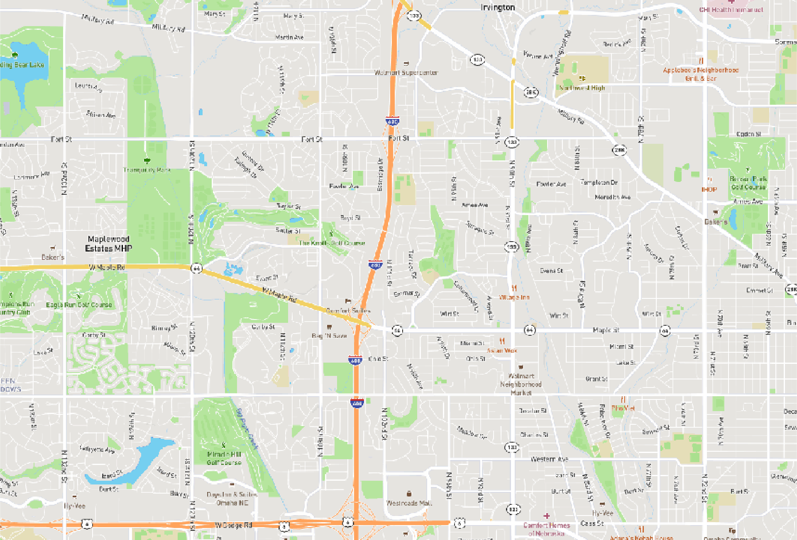
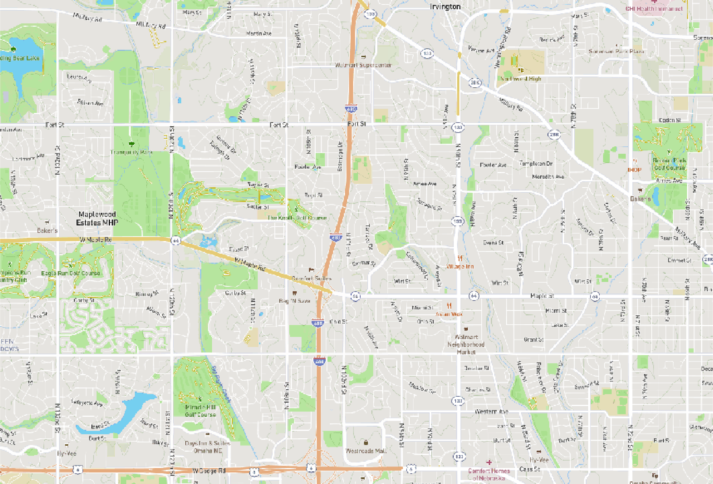

```{r pkg-load, echo = FALSE, message = FALSE}
library (mapscanner)
```

This short vignette demonstrates the three map styles available in the 
[`ms_generate_map()`](https://docs.ropensci.org/mapscanner/reference/ms_generate_map.html)
function. These correspond to three of the styles provided by
[mapbox](https://docs.mapbox.com/api/maps/#styles), converted to black and
white format for use with `mapscanner`. The styles are demonstrated here using
the same area of Omaha, Nebraska, U.S.A., defined as the bounding box provided
by the [`osmdata::getbb()`
function](https://ropensci.github.io/osmdata/reference/getbb.html), shrunk to
30% of it's size.
```{r omaha-bb-fakey, eval = TRUE}
bb <- osmdata::getbb ("omaha nebraska")
shrink <- 0.3 # shrink that bounding box to 30% size
bb <- t (apply (bb, 1, function (i)
                 mean (i) + c (-shrink, shrink) * diff (i) / 2))
bb
```
```{r omaha-bb, echo = FALSE}
t (cbind ("x" = c (-96.12923, -96.01011),
          "y" = c (41.26145,  41.32220)))
```

The following then illustrates the three different styles enabled by the
`style` parameter of the [`ms_generate_map()`
function](https://docs.ropensci.org/mapscanner/reference/ms_generate_map.html).

### style = 'light'

```{r style-light, eval = TRUE}
ms_generate_map (bbox = bb, max_tiles = 16L, style = "light",
                 mapname = "omaha-light")
image (png::readPNG ("omaha-light.png") [, , 1], col = gray.colors(20),
       xaxt = "n", yaxt = "n")
```


### style = 'streets'

```{r style-streets, eval = TRUE}
ms_generate_map (bbox = bb, max_tiles = 16L, style = "streets",
                 mapname = "omaha-streets")
image (png::readPNG ("omaha-streets.png"), col = gray.colors(20),
       xaxt = "n", yaxt = "n")
```



### style = 'outdoors'

```{r style-outdoors, eval = TRUE}
ms_generate_map (bbox = bb, max_tiles = 16L, style = "outdoors",
                 mapname = "omaha-outdoors")
image (png::readPNG ("omaha-outdoors.png"), col = gray.colors(20),
       xaxt = "n", yaxt = "n")
```



