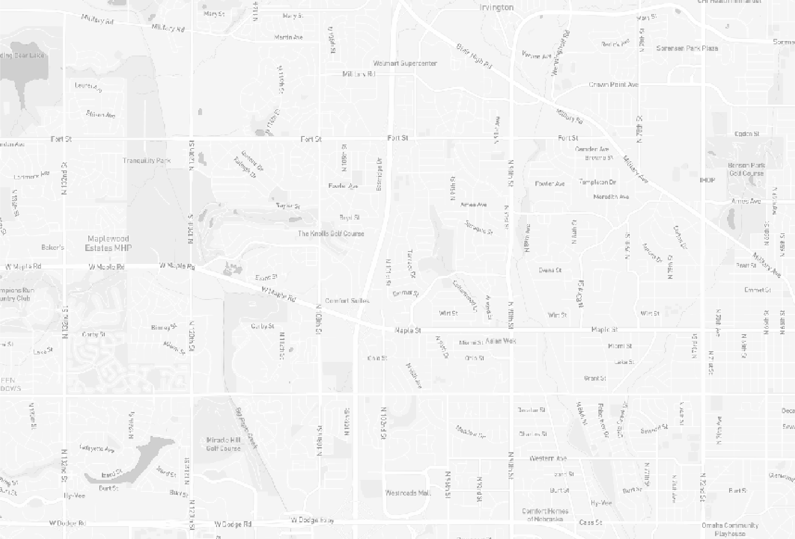

```{r pkg-load, echo = FALSE, message = FALSE}
library (mapscanner)
```

This short vignette demonstrates the three map styles available in the 
[`ms_generate_map()`](https://docs.ropensci.org/mapscanner/reference/ms_generate_map.html)
function. These correspond to three of the styles provided by
[mapbox](https://docs.mapbox.com/api/maps/#styles), converted to black and
white format for use with `mapscanner`. The styles are demonstrated here using
the same area of Omaha, Nebraska, U.S.A., defined as the bounding box provided
by the [`osmdata::getbb()`
function](https://ropensci.github.io/osmdata/reference/getbb.html), shrunk to
30% of it's size.
```{r omaha-bb-fakey, eval = FALSE}
bb <- osmdata::getbb ("omaha nebraska")
shrink <- 0.3 # shrink that bounding box to 30% size
bb <- t (apply (bb, 1, function (i)
                 mean (i) + c (-shrink, shrink) * diff (i) / 2))
bb
```
```{r omaha-bb, echo = FALSE}
bb <- t (cbind ("x" = c (-96.12923, -96.01011),
                "y" = c (41.26145,  41.32220)))
bb
```

The following illustrates the three different styles enabled by the
`style` parameter of the [`ms_generate_map()`
function](https://docs.ropensci.org/mapscanner/reference/ms_generate_map.html).

### style = 'light'

The "light" style is the only monochrome style, and so is always rendered
black-and-white.

```{r style-light, eval = !file.exists ("omaha-light.png")}
ms_generate_map (bbox = bb,
                 max_tiles = 16L,
                 mapname = "omaha-light",
                 style = "light")
```
```{r light-output, echo = FALSE}
msg <- function (type)
    message (paste0 ("Successfully generated 'omaha-",
                     type, ".pdf' and 'omaha-", type, ".png'"))
msg ("light")
```

<!--

-->
```{r omaha-light-png, echo = FALSE, out.width = "100%", eval = TRUE}
knitr::include_graphics ("omaha-light.png")
```


### style = 'streets'

Both the "streets" and the following "outdoors" styles are coloured maps,
rendered here with `bw = FALSE`. These maps may be easier to draw on if
generated with the default `bw = TRUE`.

```{r style-streets, eval = !file.exists ("omaha-streets.png")}
ms_generate_map (bbox = bb,
                 max_tiles = 16L,
                 mapname = "omaha-streets",
                 style = "streets",
                 bw = FALSE)
```
```{r streets-output, echo = FALSE}
msg ("streets")
```
```{r omaha-streets-png, echo = FALSE, out.width = "100%", eval = TRUE}
knitr::include_graphics ("omaha-streets.png")
```


### style = 'outdoors'

```{r style-outdoors, eval = !file.exists ("omaha-outdoors.png")}
ms_generate_map (bbox = bb,
                 max_tiles = 16L,
                 mapname = "omaha-outdoors",
                 style = "outdoors",
                 bw = FALSE)
```
```{r outdoors-output, echo = FALSE}
msg ("outdoors")
```
```{r omaha-outdoors-png, echo = FALSE, out.width = "100%", eval = TRUE}
knitr::include_graphics ("omaha-outdoors.png")
```


